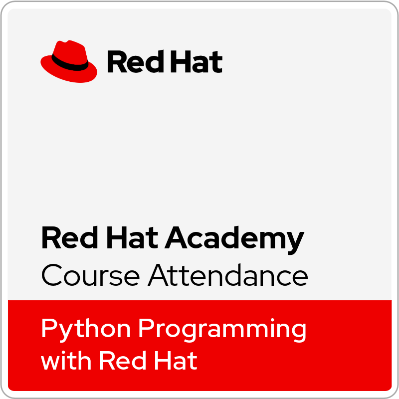

<h1 align="center">
    Hello there
    
</h1>

I'm **Natan S. Rodrigues**, a 21-year-old computer science student at **UniFil** (graduating 2028) and **Full Stack Python** course graduate at **EBAC**.  
I code in **HTML, CSS, JavaScript, Java, C, PHP, Pascal and Python**.  

💡 Winner of **Ideathon IntegraQM**. Passionate about leveraging technology to create solutions.

 🎧 Music lover | 🎮 Gamer | 👨‍💻 Tech enthusiast.

 

  
  
  
  

- 🔭 I’m currently working as part of the technical support team at UNIWARE.
- 📫 How to reach me: @nathansunrodriguez
- 👾 Software Developer | Python & Java Developer | Full Stack Student | Tech Enthusiast

---

    

        
## 🏅 Certificates 

- 📜 Profissão TI: Zero ao Pro — EBAC
- 📜 Introduction to Programming — EBAC
- 📜 Career Planning — EBAC
- 

## Competitions & Hackathons
- 🏆 Hackathon Participant — Participated in 5+ hackathons, developing innovative solutions under pressure.
- 🏆 Ideathon Winner — 🥈 IntegraQM Ideathon, recognized for the best solution presented.

## University Coursework
- Software Architecture: Architecture and Requirements
- Communication and Problem Solving
- Basic Nutritional Concepts for Adults and Elderly
- Requirements Management: Software Artifacts
- Project Management: PMBOK-based Approach
- Psychosocial Skills for Career Development
- Introduction to Computing and General Systems Theory
- Brazilian Sign Language (LIBRAS)
- Digital Marketing
- Agile Methodologies: Introduction to Agile
- Public Speaking
- First Aid
- Baking: Practical Bread and Pasta Recipes
- Software Testing: Introduction to Software Testing

  
  
  
  
   
  
  
  

    

        
## 🔥 GitHub Stats

<!--

--> 

---

## 💻 My setup: 

    

---

## 🌟 Skills & Tools:
### 💻 Programming Languages

  
  
  
  
  
   
  

 

### 🛠️ Tools & Platforms

  
     
     
    
    
     
<!--     -->
     
     

 

---

## ⚙️ Currently Learning

    <ul>
        <li>🐍 Python</li>
    </ul>

 

---

<!-- 

    

        
## 🏆 My Trophies: 

    

        
 
    

     

 
--- 
-->

## 🌐 Find Me Online 
      

&copy; 2024-present <a href="https://github.com/masunsolar/" target="_blank">Maçã</a>

